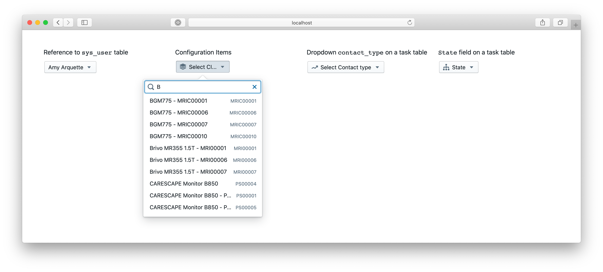
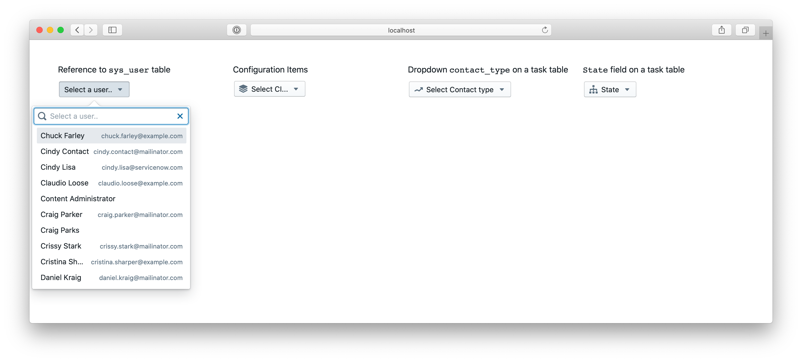
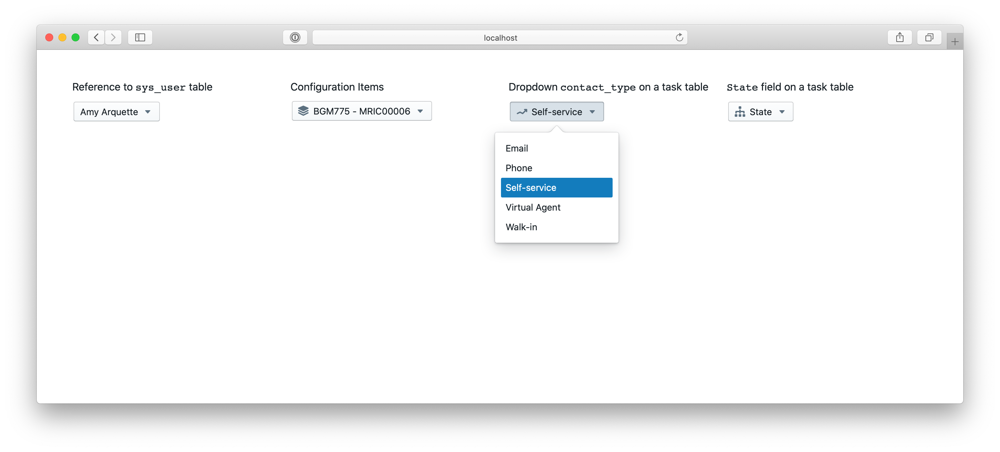

# ServiceNow reference field and dropdown built in React

Implementation of a ServiceNow Reference field and a Dropdown in React. 

## How to install
1. Clone the repo
2. Run `npm install`
3. Update `./webpack/servicenow.config.js` with the ServiceNow instance name, user name and password - this is required to run the app locally
4. Run `npm start`
5. The application will be available at http://localhost:9000/



### Reference field

You can find a component implementation in `reference-field.js`. It is based on [react-window](https://github.com/bvaughn/react-window) and [react-window-infinite-loader](https://github.com/bvaughn/react-window-infinite-loader/) and can be easily modified to address required styles, additional functionality etc.

Key features:
* Effectively works with thousands of records
* Interactive real-time filtering
* Based on ServiceNow Table API
* Can be easily modified to address custom requirements
* ~130 lines of code



Example of how to use:
```html
<ReferenceField 
    table="sys_user"
    primaryField="name" 
    secondaryField="email" 
    placeholder="Select a user.." 
    onChange={handleUser}/>
```

API:

 - table - ServiceNow table to pull records from
 - primary field - primary field to be used for filtering
 - secondary field - secondary field to display in the list
 - placeholder - text to display when nothing selected yet
 - onChange - function to be triggered when a record selected
 - icon - blueprintjs icon name (https://blueprintjs.com/)

### Dropdown
Dropdown component implemented in `dropdown-field.js`. It is a simple implementation with no particular dependencies, except of axios (http calls) and blueprintjs (styling).

Key features:
* Based on ServiceNow Table API
* Can be easily modified to address custom requirements
* ~30 lines of code



Example of how to use:
```html
<DropDownField 
    table="task" 
    field="state" 
    placeholder="State" 
    icon="diagram-tree"
    onChange={handleChoice}/>
```

API:

- table - ServiceNow where the dropdown defined
- field - ServiceNow field name
- placeholder - text to display when nothing selected yet
- icon - blueprintjs icon name [https://blueprintjs.com/](https://blueprintjs.com/)
- onChange - function to be triggered when option selected

## Questions and support
For questions and support - you can post them directly on github.

Requests for custom functionality - please contact info@elinsoftware.com.